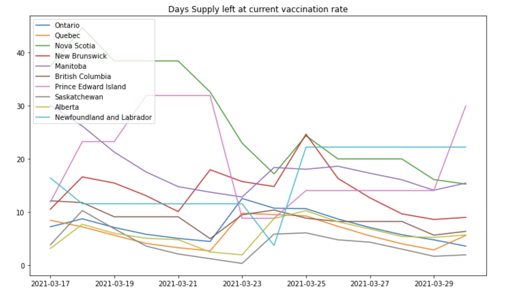

# Covid19-vaccine-in-Canada

Various statistics on the COVID 19 pandemic in Canada, computed using the API at https://covid19tracker.ca/vaccinationtracker.html

In particular I compute the number of days our current vaccine supply would last at the current rate of daily vaccination, which is a better statistics than the "vaccine graph" gap given on the Covid19tracker website. Indeed, the "vaccine gap" graph on the website does not convey the full message of the data. It gives a mix of global information (how many vaccines have been administered so far) and local information (how much supply do we have). As the campaign continues, the global information would dominate the graph, which might mask the fact that we may not be able to keep up with the supply. Besides, the vaccine gap graph is not normalized, so it is hard to compare different provinces with very different populations. 

Giving the number of days our current vaccine supply would last at the current rate of daily vaccination (or, say, the average of daily vaccination over the last 7 days) addresses both these issues . If this number is too high, this indicates that the vaccination process could be ramped up. If this number is too low, vaccination centers may have to temporarily shut down while awaiting new arrivals. It also let us think about the opportunity cost of the current effort. If we consistently have 10 days of supply left, it means that we could have (in principle) shifted the whole program 10 days ahead. 

